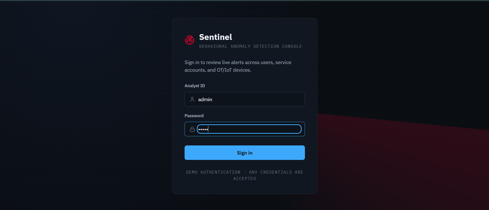
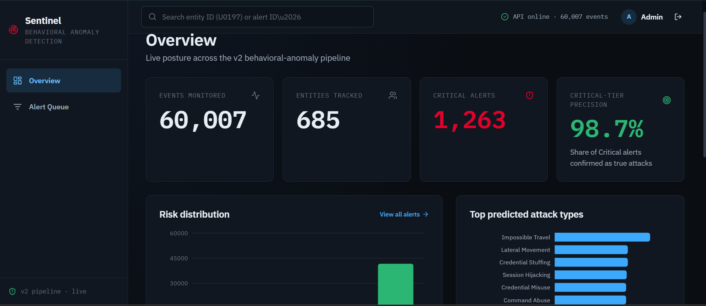
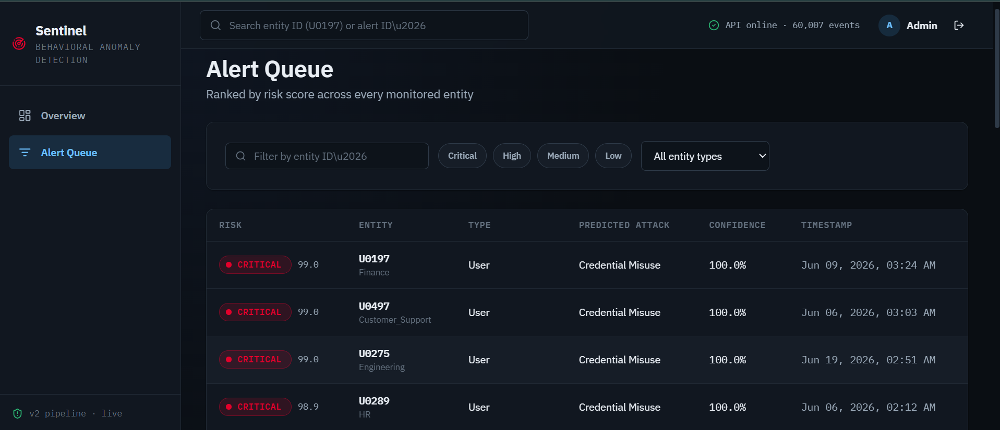
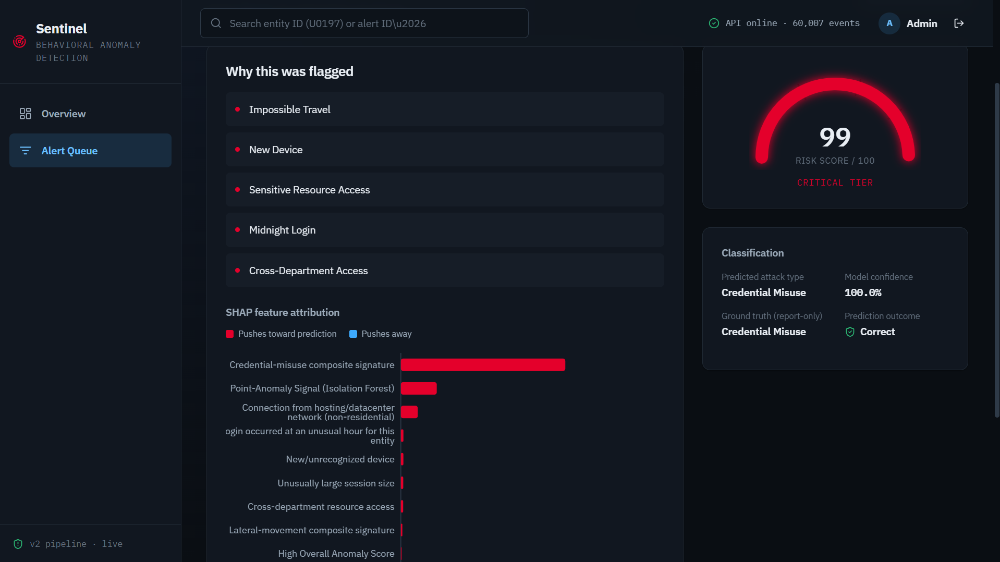
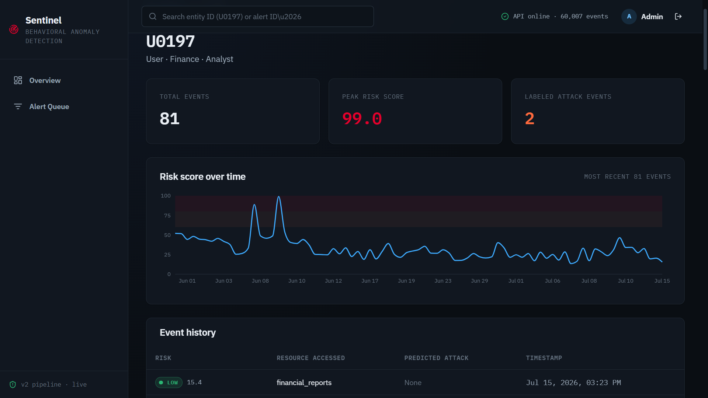

# Sentinel — AI-Powered Behavioral Anomaly Detection

**A domain-agnostic, explainable behavioral anomaly detection system for cybersecurity, built for the Honeywell AI Hackathon.**

Sentinel learns what "normal" access looks like for every user, service account, and device on a network — then flags, classifies, and explains deviations in near real time, across a domain-agnostic entity taxonomy spanning IT users, service accounts, and OT/IoT devices (edge gateways, industrial controllers, servers).

---

## Table of Contents

- [Project Overview](#project-overview)
- [Problem Statement](#problem-statement)
- [Features](#features)
- [System Architecture](#system-architecture)
- [Folder Structure](#folder-structure)
- [Installation](#installation)
- [Backend Setup](#backend-setup)
- [Frontend Setup](#frontend-setup)
- [Running the Application](#running-the-application)
- [Running the Test Suite](#running-the-test-suite)
- [API Endpoints](#api-endpoints)
- [Technology Stack](#technology-stack)
- [Model Pipeline](#model-pipeline)
- [Screenshots](#screenshots)
- [Future Work](#future-work)
- [Authors](#authors)

---

## Project Overview

Traditional signature-based security fails against novel or slow, low-and-slow intrusions. Sentinel takes the behavioral approach instead: it builds a statistical and sequential model of what "normal" looks like for every entity in an organization, then scores, classifies, and explains deviations from that baseline — regardless of whether the entity is a human analyst, a service account, or an industrial edge gateway.

The system is built as a complete, working pipeline: synthetic data generation → feature engineering → two-stage ML detection → rule-based + SHAP risk scoring → a live-inference FastAPI backend → a React analyst dashboard — with an automated test suite covering the backend end-to-end.

The project ships **two parallel tracks**:
- **v1**: an initial 500-user, single-entity-type, 5-attack-type baseline, kept frozen as a historical/report reference.
- **v2** (the active, fully-deployed track covered by this README): 685 entities across **6 entity types**, **12 attack types**, and **86 engineered behavioral features**.

## Problem Statement

> Design and build an AI/ML system that models "normal" access and connection behaviour for users and devices, detects intrusions or compromised-credential activity in near real-time, and classifies the type of anomaly — with an explainable risk score.

The system must handle:
1. **Sequential and behavioural data** — access events over time, not static snapshots.
2. **Extreme class imbalance** — true intrusions are ~2.5% of all events.
3. **Concept drift** — legitimate behaviour evolves and shouldn't be permanently flagged.
4. **Explainability** — an analyst needs to know *why* an event was flagged, not just a score.
5. **Cold-start** — scoring a brand-new user or device with no history.
6. **Domain-agnosticism** — the same ML approach must work for IT users, service accounts, and OT/IoT devices (industrial edge gateways, controllers, home IoT hubs).

## Features

- **Synthetic data generator** (v2): 685 entities, 6 entity types (`user`, `service_account`, `edge_device`, `iot_device`, `industrial_controller`, `server`), 12 injected attack types with MITRE ATT&CK technique tags, org-hierarchy modeling (department/role/privilege/manager).
- **86-feature engineered pipeline**: device trust, network/geo velocity, authentication, resource access, command sequences, session behavior, peer-group/org baselines, cold-start scoring, temporal cyclical encodings, and 10 attack-specific composite scores — see [`FEATURE_CATALOG.md`](FEATURE_CATALOG.md).
- **Two-stage ML detection**: unsupervised Isolation Forest + LSTM Autoencoder fusion (Stage 1) feeding a 13-class (12 attacks + benign) XGBoost classifier (Stage 2).
- **Explainable risk scoring**: a weighted fusion of the anomaly score, classifier confidence, and 9 auditable, entity-type-aware security rules, merged with real SHAP `TreeExplainer` attributions into a ranked, human-readable reasons list.
- **Live inference API**: score a brand-new event in real time (including genuinely new/cold-start entities), not just batch-replay historical data.
- **Analyst dashboard**: ranked/filterable alert queue, alert detail with SHAP visualization and a risk-score gauge, entity history with a risk-over-time chart, dashboard-wide stats.
- **Automated test suite**: 26 backend tests covering every endpoint, entity-type-aware rule behavior, cold-start handling, input validation, and CORS.

## System Architecture

```
                         ┌─────────────────────────────────────────┐
                         │              scripts/ (batch)            │
                         │                                          │
  generate_logs_v2.py ──▶│  raw access logs (60,007 events)         │
                         │            │                             │
                         │            ▼                             │
  feature_engineering_v2.py │  86 engineered features (features_v2.csv) │
                         │            │                             │
                         │            ▼                             │
  train_stage1_anomaly_  │  Isolation Forest + LSTM-AE fusion        │
  detection_v2.py        │  → anomaly_scores_v2.csv                  │
                         │            │                             │
                         │            ▼                             │
  train_stage2_          │  XGBoost 13-class attack classifier       │
  classification_v2.py   │  → stage2_predictions_v2.csv              │
                         │            │                             │
                         │            ▼                             │
  risk_scoring_engine_   │  Rules + SHAP → risk_scores_v2.csv         │
  v2.py                  │  (the scored dataset everything below     │
                         │   is served from)                         │
                         └───────────────┬──────────────────────────┘
                                          │
                                          ▼
                         ┌─────────────────────────────────────────┐
                         │         backend/ (FastAPI, live)         │
                         │                                          │
                         │  Loads all 5 trained v2 models once at   │
                         │  startup + the fully-scored dataset.     │
                         │                                          │
                         │  /predict   → live Stage1→Stage2→Risk    │
                         │  /explain   → SHAP explanation lookup    │
                         │  /alerts    → ranked, filterable queue   │
                         │  /entities  → entity history             │
                         │  /stats     → dashboard overview stats   │
                         └───────────────┬──────────────────────────┘
                                          │ REST (JSON, CORS-enabled)
                                          ▼
                         ┌─────────────────────────────────────────┐
                         │        frontend/ (React 18 + Vite)       │
                         │                                          │
                         │  Login → Overview → Alert Queue →        │
                         │  Alert Detail (SHAP + risk gauge) →      │
                         │  Entity History                          │
                         └─────────────────────────────────────────┘
```

**Key design principle**: the backend does not duplicate the ML pipeline's logic. `backend/app/dependencies.py` directly imports `scripts/train_stage1_anomaly_detection_v2.py`, `scripts/train_stage2_classification_v2.py`, and `scripts/risk_scoring_engine_v2.py` as Python modules and calls their functions/constants directly — one single source of truth for feature lists, rules, and scoring logic, used identically in both batch and live-inference paths.

## Folder Structure

```
project-root/
├── FEATURE_CATALOG.md                  # Full description of all 86 v2 features
├── FEATURE_DEPENDENCY_AND_FLOW.md       # Feature computation order/dependencies
├── README.md                            # This file
│
├── scripts/                             # Batch ML pipeline (v1 = frozen baseline, v2 = active)
│   ├── generate_logs.py / generate_logs_v2.py
│   ├── feature_engineering.py / feature_engineering_v2.py
│   ├── train_stage1_anomaly_detection.py / _v2.py
│   ├── train_stage2_classification.py / _v2.py
│   └── risk_scoring_engine.py / _v2.py
│
├── dataset/
│   ├── raw/            raw_v2/          # Raw synthetic access logs
│   └── processed/                       # Engineered features + scored outputs (v1 and v2)
│
├── models/                              # Trained artifacts (v1 and v2, loaded not retrained)
│   ├── isolation_forest_v2.joblib
│   ├── feature_scaler_v2.joblib
│   ├── lstm_autoencoder_v2.keras
│   ├── xgb_attack_classifier_v2.json    # Native XGBoost JSON format (see note below)
│   ├── label_encoder_v2.joblib
│   └── ...                              # v1 equivalents (isolation_forest.joblib, etc.) kept as a frozen baseline
│
├── backend/                             # FastAPI live-inference + analyst API
│   ├── requirements.txt
│   ├── pytest.ini
│   ├── app/
│   │   ├── main.py                      # App entrypoint, CORS, router registration
│   │   ├── config.py                    # Central path configuration
│   │   ├── dependencies.py              # Model loading + pipeline-script reuse
│   │   ├── schemas.py                   # Pydantic request/response models
│   │   ├── routers/                     # health, predict, explain, analyst
│   │   └── services/                    # scoring_service, explain_service, analyst_service
│   └── tests/                           # 26-test pytest suite
│
└── frontend/                            # React 18 + Vite analyst dashboard
    ├── package.json
    ├── index.html
    ├── .env                             # VITE_API_BASE_URL
    └── src/
        ├── api/client.js                # Backend REST client
        ├── context/AuthContext.jsx      # Demo authentication
        ├── hooks/useApi.js
        ├── components/{common,layout,viz}/
        ├── pages/                       # Login, Overview, AlertsQueue, AlertDetail, EntityHistory
        └── styles/                      # Design-token CSS system
```

> **Note on `xgb_attack_classifier_v2.json`**: the XGBoost classifier is stored in XGBoost's native JSON format rather than joblib/pickle. This was a deliberate fix after the joblib artifact repeatedly failed to load after download/transfer (`XGBoostError: input stream corrupted`) despite loading correctly server-side. `predict()`/`predict_proba()` output was verified byte-for-byte identical between the two formats before switching.

## Installation

### Prerequisites
- **Python 3.12** (this project was built and verified on 3.12.3)
- **Node.js 22** and **npm 10** (built and verified on Node 22.22.2 / npm 10.9.7)
- ~2 GB free RAM for the backend (loads 5 models + a 60,007-row dataset + builds a SHAP explainer at startup)

Clone or download the project, then set up the backend and frontend as described below.

## Backend Setup

```bash
cd backend
python -m venv .venv

# Windows
.venv\Scripts\activate
# macOS/Linux
source .venv/bin/activate

pip install -r requirements.txt

# TensorFlow is intentionally left unpinned in requirements.txt (any
# version providing Keras 3 works, since lstm_autoencoder_v2.keras is
# saved in Keras 3's native format). To match the exact environment this
# project was built and verified against:
pip install tensorflow==2.21.0
```

**Do not** manually pin a `keras` version alongside `tensorflow` — TensorFlow ≥2.16 requires Keras 3 and will pull in a compatible version automatically. Pinning both together (e.g. `tensorflow==2.16.1` + `keras==2.15.0`) is an impossible combination and will fail to resolve.

Verify your install:
```bash
python -c "import tensorflow as tf, keras, xgboost, shap; print(tf.__version__, keras.__version__, xgboost.__version__, shap.__version__)"
# Expect: 2.21.0 3.15.0 3.3.0 0.52.0 (or newer within the pinned ranges in requirements.txt)
```

> `shap` is pinned to `>=0.50.0` in `requirements.txt` — versions at or below `0.49.1` cannot parse this project's multiclass XGBoost model's `base_score` field and will crash on backend startup. See [`requirements.txt`](backend/requirements.txt) for the full root-cause note.

## Frontend Setup

```bash
cd frontend
npm install
```

The frontend reads its backend URL from `frontend/.env`:
```
VITE_API_BASE_URL=http://127.0.0.1:8000
```
Change this if your backend runs on a different host/port.

## Running the Application

**1. Start the backend** (from the **project root**, not from inside `backend/` — the app uses relative imports and must be run as a package):

```bash
python -m uvicorn backend.app.main:app --reload
```

First startup takes **60–90 seconds** — it loads 5 trained models, builds a SHAP `TreeExplainer`, computes historical LSTM-AE baselines, and reads the 60,007-row scored dataset into memory. This is expected, not a hang. You'll know it's ready when you see:
```
INFO:     Application startup complete.
INFO:     Uvicorn running on http://127.0.0.1:8000
```

Verify it's healthy:
```bash
curl http://127.0.0.1:8000/health
curl http://127.0.0.1:8000/api/v1/status
```
`/api/v1/status` should report all 5 models `"loaded": true` and `"dataset_rows_loaded": 60007`.

**2. Start the frontend** (in a separate terminal):
```bash
cd frontend
npm run dev
```
Open the printed URL (default `http://localhost:5173`). Log in with **any** username and password (demo authentication — see [Future Work](#future-work)).

## Running the Test Suite

```bash
cd backend
python -m pytest
```

This runs **26 tests** across 5 files:

| File | Tests | Covers |
|---|---|---|
| `test_health.py` | 2 | Liveness, full model-load status |
| `test_analyst.py` | 12 | Alert queue pagination/filtering, alert detail, entity history, dashboard stats |
| `test_explain.py` | 2 | SHAP explanation structure, 404 handling |
| `test_predict.py` | 7 | Live scoring (attack/benign/cold-start), input validation, entity-type-aware rules |
| `test_cors.py` | 3 | Cross-origin request handling |

The suite uses a session-scoped `TestClient` fixture that triggers the app's real startup path once (~20-30s with warm caches) rather than mocking it — tests run against the same models and dataset the app serves in production. Several assertions hardcode exact values (e.g. `risk_level_counts`) deliberately: the dataset is frozen, so these double as regression tests against known-correct values.

## API Endpoints

All endpoints are served under the FastAPI app in `backend/app/main.py`.

| Method | Path | Description |
|---|---|---|
| `GET` | `/health` | Liveness check |
| `GET` | `/api/v1/status` | Model load status, dataset stats, uptime |
| `POST` | `/api/v1/predict` | Live scoring of a new event through Stage 1 → Stage 2 → Risk Scoring |
| `GET` | `/api/v1/explain/{log_id}` | SHAP explanation + top-10 feature contributions for a scored event |
| `GET` | `/api/v1/alerts` | Ranked, filterable alert queue (`risk_level`, `entity_type`, `entity_id`, `min_risk_score`, pagination) |
| `GET` | `/api/v1/alerts/{log_id}` | Single alert detail |
| `GET` | `/api/v1/entities/{entity_id}/history` | Entity event history + summary stats |
| `GET` | `/api/v1/stats/overview` | Dashboard-wide summary stats |

Interactive OpenAPI docs are available at `http://127.0.0.1:8000/docs` once the backend is running.

## Technology Stack

**ML / Data Pipeline**
- Python 3.12, NumPy, pandas
- scikit-learn (Isolation Forest, StandardScaler, LabelEncoder)
- TensorFlow / Keras 3 (LSTM Autoencoder)
- XGBoost (multiclass attack classifier)
- SHAP (`TreeExplainer`) for explainability

**Backend**
- FastAPI + Uvicorn
- Pydantic v2 (request/response schemas)
- pytest (test suite)

**Frontend**
- React 18 + Vite
- React Router v6 (routing)
- Recharts (data visualization)
- lucide-react (icons)
- Hand-rolled CSS design-token system (no UI framework)

## Model Pipeline

| Stage | Script | Model(s) | Output |
|---|---|---|---|
| 1. Data generation | `generate_logs_v2.py` | — | `access_logs_v2.csv`, `entities_v2.csv` |
| 2. Feature engineering | `feature_engineering_v2.py` | — | `features_v2.csv` (86 features) |
| 3. Anomaly detection | `train_stage1_anomaly_detection_v2.py` | Isolation Forest + LSTM Autoencoder (weighted fusion) | `anomaly_scores_v2.csv` |
| 4. Attack classification | `train_stage2_classification_v2.py` | XGBoost (13-class: 12 attacks + benign) | `stage2_predictions_v2.csv` |
| 5. Risk scoring | `risk_scoring_engine_v2.py` | Rules + SHAP `TreeExplainer` | `risk_scores_v2.csv` |

**Known metrics** (on the frozen v2 dataset, 60,007 events / 685 entities):
- Stage 1 fused anomaly detector: **ROC-AUC 0.9439**
- Stage 2 classifier: **99.66% test accuracy** across 13 classes
- Final risk scoring: **98.7% precision** at the Critical tier (1,263 alerts)

The live backend (`POST /api/v1/predict`) runs the exact same fusion/classification/scoring logic on a single new event, including a cold-start path (zero-padded LSTM sequencing) for entities with no prior history, and normalizes live scores against the same historical distribution the batch pipeline produced — see `backend/app/services/scoring_service.py` for the full explanation of why online and batch normalization needed to be handled differently.

## Screenshots

| Login | Overview |
|---|---|
|  |  |

| Alert Queue | Alert Detail |
|---|---|
|  |  |

| Entity History |
|---|
|  |

## Future Work

- **Real authentication**: the frontend currently uses demo authentication (any credentials succeed); no auth layer exists on the backend yet.
- **Streaming ingestion**: the backend's `/predict` endpoint scores one event at a time on request; a production deployment would front it with a streaming ingestion layer (Kafka/Kinesis) for continuous scoring.
- **Persistent storage**: `risk_scores_v2.csv` is loaded into memory at startup; a production system would use a proper database (with the historical-sequence and alert-query patterns already established in `backend/app/dependencies.py` and `analyst_service.py` translating directly to SQL).
- **v1 → v2 pipeline retirement**: v1's scripts/models are kept only as a frozen historical baseline for the project report; a production deployment would remove them.
- **Docker/Compose packaging**: no containerization exists yet; the backend's ~2GB RAM / 60-90s cold start would benefit from a documented container image.
- **Consolidated report and presentation deck**: per the original problem statement's deliverables list.
- **Concept-drift retraining loop**: the pipeline computes drift-related features (`behavioral_drift_score`, `adaptive_threshold`) but there is no automated retraining trigger based on them yet.

## Authors

Built for the Honeywell AI Hackathon — Behavioral Anomaly Detection track.
