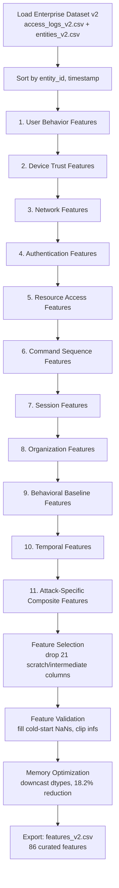
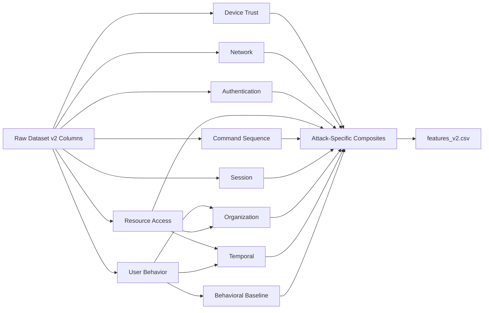

# Feature Dependency Graph & Pipeline Flow Diagram — Feature Engineering v2

## Pipeline Flow Diagram

Execution order through `feature_engineering_v2.py`. Each stage reads only raw
dataset columns plus outputs of *earlier* stages (no forward references),
which is what makes the pipeline a valid single-pass computation.

## Feature Dependency Graph

Which categories build on which. Arrows mean "reads output columns from."

## Why This Order Matters

1. **User Behavior, Device Trust, Network, Authentication, Resource Access, Command Sequence, Session** are all "leaf" categories — they read only raw dataset columns (plus their own shift/rolling history). They can technically run in any order relative to each other.
2. **Organization** depends on Resource Access (`resource_sensitivity`) and general entity attributes — must run after Resource Access.
3. **Behavioral Baseline** and **Temporal** depend on User Behavior's `login_hour`/`expanding_mean_hour` computations.
4. **Attack-Specific Composites** is deliberately LAST — every composite score (e.g. `insider_threat_score`) is a weighted blend of columns from multiple earlier categories (`resource_sensitivity_deviation` from Resource Access + `peer_group_resource_sensitivity_deviation` from Organization), so it cannot run until all its inputs exist.
5. **Feature Selection → Validation → Memory Optimization → Export** always runs last, once, over the fully-assembled feature matrix.

## Key Design Note: No Circular Dependencies

Every stage function takes `df` and returns `df` with *new* columns appended — no stage ever needs to re-read or modify a column produced by a *later* stage. This makes the pipeline trivially parallelizable across independent leaf categories in a future Spark/Flink port, and makes debugging tractable (a bug in Stage N can only be caused by Stage N's own logic or genuine data issues in Stages 1..N-1, never by anything downstream).
